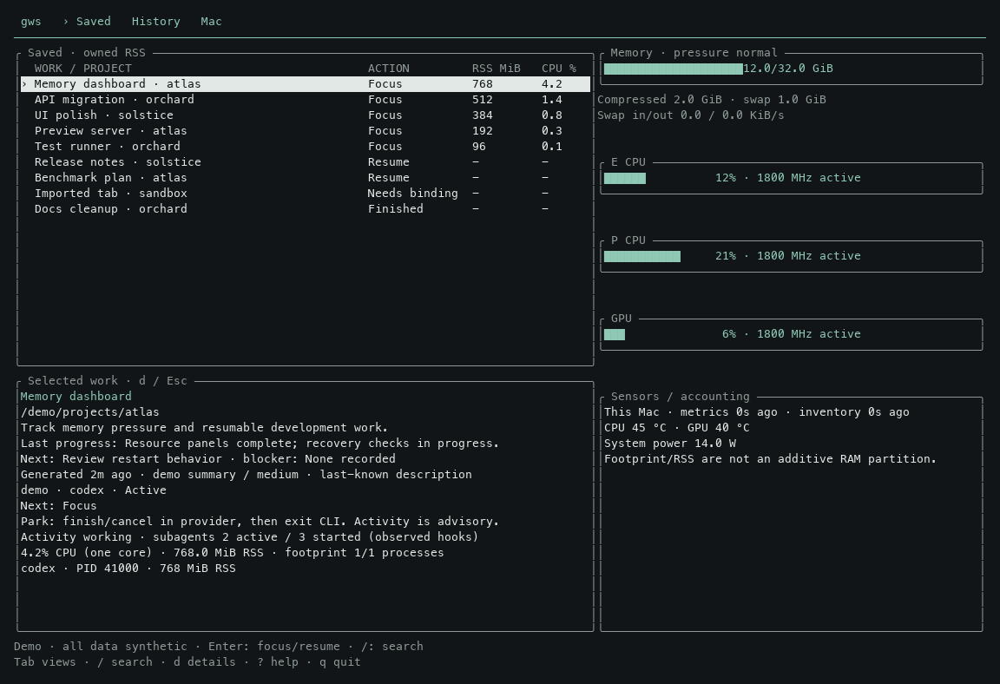

# Ghostty Workspaces

**Manage work, keep exact conversation identities, and see what is consuming resources.**

`gws` is a small Rust terminal dashboard for macOS and Ghostty 1.3+. It uses native Ghostty tabs and public AppleScript automation. No Ghostty fork, terminal multiplexer, web server, login item, or permanent global daemon.



*All work names, paths, processes, descriptions and machine readings in this illustration are dummy data, rendered by the actual dashboard.*

## How it works

Think of a saved item as a bookmark for a piece of work. It survives the terminal closing and the computer restarting. An execution is one run of that work; a Ghostty tab is where the run appears.

| Part | What it records | Example |
| --- | --- | --- |
| Work item | Stable ID, name, workspace label, project directory and provider | “Dashboard work”, `/projects/dashboard`, Codex |
| Conversation | Exact provider session/chat ID and provider configuration home | The particular conversation to resume |
| Run | Execution identity, process ownership, outcome and observed activity | Today's execution of that conversation |
| Terminal | Current Ghostty surface, when available | Focus the existing tab rather than duplicate it |
| Description | On-request summary and its source/time | Purpose, progress, blocker and next step |

The directory selects the project. The conversation ID selects the conversation. A workspace is simply a grouping label. The saved work ID remains stable across runs; PID and terminal identities can change.

For new work, start with `gws codex`, `gws claude` or `gws cursor` in the project directory. The item is saved before launch. Codex/Claude lifecycle hooks record the conversation when available; Cursor creates or resumes an exact chat ID. Hooks must be accepted through the provider's normal trust flow. After exit or reboot, explicitly open one item or review a workspace restore plan. The dashboard itself never starts every saved item automatically.

## Install and launch

```sh
git clone https://github.com/btgaskin/ghostty-workspaces.git
cd ghostty-workspaces
cargo install --locked --path .
gws doctor

gws codex                       # current directory
gws claude ~/dev/project
gws cursor -C ~/dev/project
gws shell ~/dev/project
gws command ~/dev/project -- npm run dev
gws                             # dashboard here
gws launch                      # dashboard in a native Ghostty window
```

Use a positional directory or `--cwd` / `-C`. Provider options go after `--`; provider `resume` and Codex `fork` subcommands also work. `gws new codex` remains compatible.

```sh
gws codex ~/dev/project -- --model MODEL
gws codex -C ~/dev/project resume CONVERSATION_UUID
gws claude -C ~/dev/project resume CONVERSATION_UUID
gws cursor -C ~/dev/project --conversation CHAT_ID
gws codex --no-daemon            # explicitly opt into a private Codex server
```

Codex's shared server remains the default. `--no-daemon` is opt-in and does not establish safe automated shutdown. Normal provider permissions and hook trust remain in place. Review scoped Codex hooks in `/hooks` if requested; `gws` does not accept that trust prompt for you.

Optional [macmon](https://github.com/vladkens/macmon) supplies Apple Silicon E/P CPU, GPU, temperature and power (`brew install macmon`). Process and memory monitoring work without it. Hardware collectors exist only while requested.

## Continuity and existing tabs

Managed work is saved immediately, independently of shutdown. A stable work ID holds its directory, provider home, exact conversation ID, options and dependencies. Each execution has a separate run identity and durable history.

```sh
gws save                        # record current Ghostty surfaces
gws bind --auto --dry-run
gws bind --auto
gws bind SAVED_WORK_ID CONVERSATION_ID
gws list --json
gws inspect SAVED_WORK_ID --json
```

Existing Codex discovery requires reciprocal unique process/cwd/launch matches and a bounded root transcript metadata record. Titles alone are unverified. Ambiguous matches stay unresolved; identical tabs are never assigned by order or newest file. Imported processes have conservative control capabilities. Existing Claude/Cursor sessions can be bound explicitly. Provider hooks do not attach retroactively.

### What “Needs binding” means

The tab has been saved, but `gws` does not yet have a verified conversation ID to reopen. It does **not** mean that the transcript is lost or that the provider needs logging in again. Two conversations can use the same folder, so choosing that folder's newest conversation would risk resuming the wrong work.

This usually occurs with tabs that were already running before `gws` managed them, or when a managed provider's session-start hook did not record an identity. A title containing an ID is only a clue until verified. New work that has not started yet does not need a pre-existing conversation.

Run `gws bind --auto --dry-run` to inspect unambiguous live Codex matches, then `gws bind --auto` to record them. For remaining items, get the exact ID from that provider's session UI and use `gws bind WORK_ID CONVERSATION_ID`. `gws list` supplies the work IDs; `gws sessions --query 'project'` helps inspect the history catalog. Manual binding records the identity you supply; it does not independently prove that you selected the correct conversation, restart the tab, or attach hooks retroactively. Imported work remains conservative about process control.

After reboot, opening `gws` shows the register without launching all saved work:

```sh
gws restore --preview           # returns a plan ID; no providers start
gws apply PLAN_ID --wait         # execute the exact reviewed plan
gws open SAVED_WORK_ID           # focus or explicitly resume one item
```

Missing directories, unresolved identities, live executions, changed dependencies and surviving owned processes prevent unsafe relaunches. Shells and generic commands restart; their in-memory state is not restored. Split geometry, scrollback and pixel positions are not recreated.

| Provider | Continuity | Transcript / subagent coverage |
| --- | --- | --- |
| Codex | Exact durable root conversation ID, provider home and cwd | JSONL; scoped lifecycle hooks; shared-server resource attribution remains partial |
| Claude Code | Exact session ID and cwd | JSONL when hook path is available; scoped lifecycle hooks |
| Cursor CLI | Exact chat ID via `create-chat` / `--resume` | Private transcript format is not decoded; explicit JSONL exports may be supplied. No scoped hook or subagent coverage. Rebind after changing chats with `/clear` or `/fork`. |
| Shell / arbitrary CLI | Saved executable, arguments and cwd | Restart only; provider-specific continuation requires an adapter |

## History, descriptions and search

```sh
gws history --item SAVED_WORK_ID --json
gws sessions --query 'memory pressure'
gws describe SAVED_WORK_ID       # on request: Codex Luna, medium reasoning
gws describe SAVED_WORK_ID --transcript /path/to/export.jsonl
```

The conversation catalog finds root Codex history across folders, including archived metadata, and registered Claude/Cursor conversations. Subagent logs are excluded from root results. Unchanged metadata headers are cached while the dashboard runs. `gws history` retains run outcomes even after a later execution or forgetting saved work.

### What search actually searches

1. **Discover metadata locally.** Codex root conversation headers are read from its session and archive directories, including provider homes recorded on saved items. Claude/Cursor coverage currently includes registered conversations, not a complete scan of their private histories.
2. **Fuzzy match.** The query searches names, paths, conversation identities and any already generated descriptions. Each whitespace-separated term must match; matching supports substrings and letters in order, with penalties for gaps. For example, `mem mon` can match “memory monitor.” The History view searches conversations; Saved and Mac search their own lists.
3. **Optionally rerank.** `J` in History, or `gws search --semantic`, asks Jev to assess only the top 25 fuzzy candidates. It changes their order and retains the remaining fuzzy matches. It cannot find a conversation that fuzzy retrieval missed.

This is **metadata and cached-description search**, not full-transcript text search. Unregistered Codex rows initially use their project directory name, so different conversations in one folder may look similar. A task mentioned only inside an unsummarized transcript will not be found by that phrase. Use `gws describe WORK_ID` to generate a description from a bounded transcript excerpt; generation is explicit and the description can become stale as work continues.

Descriptions record purpose, last evidenced progress, blocker and next step, with source fingerprint, conversation, model and timestamp. Only bounded user/assistant text is used; tool outputs, images, system messages and environment instructions are excluded. These generated descriptions are advisory and never prove that a run is idle or authorize cleanup. They use an ephemeral headless Codex run with project configuration and tools disabled. Model generation is never automatic.

### Optional Jev reranking

```sh
gws search-config --env-file /private/path/to/.env --min-confidence 0.6
gws search --query 'memory pressure' --semantic --json
```

Alternatively set `TYPESAFE_API_KEY`, `JEV_KEY`, or `GWS_JEV_ENV_FILE`. Configuration stores the credential file path, never the key. The file is parsed as data; it is never executed or sourced.

Fuzzy retrieval stays local and immediate. An explicit semantic search sends at most 25 fuzzy candidates to the [official Jev API](https://docs.typesafe.ai/api), using names, project basenames and cached descriptions. Raw transcripts and full absolute project paths are excluded. Jev returns relevance, its probability distribution and confidence. Confident relevant candidates move ahead; uncertain candidates retain fuzzy order; confidently unrelated candidates follow. Remaining fuzzy results stay available. Failures retain local results with an explicit error. Responses are cached for ten minutes, with at most 128 entries.

With the default `0.6` confidence threshold, confident candidates scoring at least `1` on the `0–2` relevance scale move first, uncertain candidates stay in their relative fuzzy order, and confidently unrelated candidates move last. Your query is sent along with candidate metadata; names and descriptions may contain private project information. Jev search is optional and never authorizes process actions.

The default confidence threshold is an adjustable policy, not a calibrated accuracy claim. The replaceable `RelevanceClassifier` interface retains backend/model revision for each response. A resident, hot-loaded local classifier is a future backend; no model is loaded per keystroke or kept resident by this release.

## Dashboard

Wide screens put the work list above selected details on the left, with memory and hardware panels on the right. Medium screens stack list/details with a compact machine summary. Narrow screens keep the list and offer a dedicated details view. Native terminal colors are the default; `--theme dark` uses a restrained mint palette, and `--theme mono` / `--ascii` support simpler terminals.

| Key | Action |
| --- | --- |
| Tab | Saved work / conversation History / Mac executable groups |
| `/` | Fuzzy search names, paths, identities and cached descriptions |
| `J` | Explicit Jev rerank of History search; fuzzy results remain usable |
| Arrows / `j` / `k` | Select |
| Enter | Focus/resume saved work, or inspect a history/process row |
| `o` | Register and open a selected historical conversation |
| `b` | Generate a selected saved conversation's description |
| `d`, `h`, `t` | Details / hardware view / technical identity details |
| Page Up / Page Down | Scroll details, plans and receipts |
| `p`, `f`, `r` | Preview park / finish / workspace restore |
| `Q` | Preview profiling preparation |
| `y` / Escape | Apply exact displayed plan / return or cancel preview |
| `M` | Pause / explicitly resume monitoring |
| `m`, `c`, `v` | Memory / CPU sort; Mac groups versus individual processes |
| `s` | Save current Ghostty surfaces |
| `q` | Exit dashboard |

`--ssh user@host` remains completely optional and uses existing SSH credentials, strict known-host checks and a remotely installed macmon. Default operation contacts no remote device. Remote process control is outside the core; device-panel layout is experimental.

## Parking, cleanup and profiling

A hidden or suspended tab still retains memory. To reclaim a provider's allocations, finish or cancel through its own UI, then exit the CLI. Managed terminals retain a cheap standby placeholder, with exact Resume and Details actions.

```sh
gws park SAVED_WORK_ID --preview
gws apply PLAN_ID --wait
gws quiet --preview             # eligible managed work; closes parked tabs by default
gws apply PLAN_ID --wait
gws operation PLAN_ID --json
gws restore --batch BATCH_ID --preview
gws monitoring resume
```

Running Codex/Claude/Cursor sessions are **manual-only**. Busy or unknown activity is never treated as permission to stop them. Registered services have explicit shutdown contracts and run/work/persistent lifetimes; run-scoped services are cleaned up after their owning run exits. Persistent services are excluded from default profiling preparation. See [service registration and agent commands](docs/agent-guide.md).

Plans expire, belong to one boot, protect the controller and exclusions, reserve exact items, and revalidate revisions/run identities before effects. Operations retain partial outcomes and actually stopped runs. Reapplying returns the receipt; explicit retries reconcile the same run and do not broaden scope. Cancellation prevents later steps; it does not undo completed effects.

Profiling preparation records a final audit, stops and joins dashboard collectors, cancels temporary model jobs and freezes monitoring. An acknowledgement reports the `gws` scope. Other apps, shared daemons and system services may remain active; successful managed preparation does not establish a globally quiet Mac.

## Resource accounting and diagnostics

- CPU is expressed as percent of one core; aggregate work can exceed 100%.
- Owned process trees require PID and start identity, with a recorded child fallback after supervisor loss. Reparented/shared workloads remain separately visible.
- Summed RSS can count shared pages repeatedly. Charged footprint includes compressed accounting where available; neither forms an additive partition of physical RAM.
- Memory pressure, compressed memory and swap rates distinguish current pressure from an old swap total. Unavailable counters are shown explicitly.
- Subagent counts describe observed logical lifecycle events, not OS children. Missing hooks mean unavailable, not zero.
- Mac groups use executable names, with verified per-process ownership where available. Age, repetition and suspended state are review cues, never cleanup permission.

```sh
gws audit --save --json
gws diagnostic files --pid PID --json
gws diagnostic startup --json
gws diagnostic sleep --json
```

These are bounded, on-request inspections. No weekly scheduler, arbitrary process killing, launch-registration removal or `fseventsd` diagnosis runs automatically. See [resource optimization](docs/resource-optimization.md).

## Storage and development

Private state defaults to `~/.local/share/ghostty-workspaces/`; override with `GWS_STATE_DIR` or `--state-dir`. SQLite transactions, a shared file lock and synced writes store work, runs, history, plans, receipts and caches. v0.1 JSON imports retain UUIDs and an original `workspaces.v1.backup.json`. A version-2 JSON marker fences old writers. Interrupted empty initialization is recoverable; changed legacy state after import is preserved and refused for reconciliation. Malformed and newer schemas are never overwritten.

State includes private paths, launch options, summaries and search cache. Keep it out of public repositories and avoid credentials in command arguments. Provider histories remain owned by their providers.

```sh
cargo fmt --check
cargo clippy --locked --all-targets -- -D warnings
cargo test --locked
cargo build --release --locked
```

See [architecture](docs/architecture.md) and [validation](docs/validation.md). Physical reboot, real provider continuation across reboot, and optional remote-device acceptance are separate from fixture tests.

MIT licensed. Independent of Ghostty, OpenAI, Anthropic and Cursor. [macmon](https://github.com/vladkens/macmon) (MIT, Vlad Kens) inspired the quiet hardware presentation; its sampler is optional and no UI code was copied.
